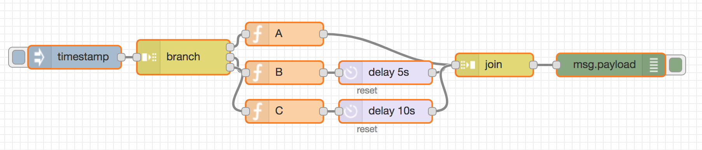

# node-red-contrib-branch
=========================

A simple Node-RED (http://nodered.org) node to branch messages that could later be reunited by a join node.

# Features

* Leaves original payload unchanged
* Allows for multiple parallel branches that can later be reassembed based on their _msgid. 
* Using a join node, all threads will be need to be completed before the join message forwards on the next message. The resulting payload will be an array containing all payloads from the various threads. 

# Install

Run the following command in the root directory of your Node-RED install (typically ~/.node-red)

    npm install node-red-contrib-branch
    
# Example

<pre>
[{"id":"2e05c962.c7ab26","type":"branch","z":"ef08c8c2.ff8aa8","name":"","outputs":"3","x":260,"y":190,"wires":[["20e03ba7.61fd44"],["40dd3dd0.46b634"],["3af7730d.1bbb7c"]]},{"id":"f1068953.6ba3d8","type":"inject","z":"ef08c8c2.ff8aa8","name":"","topic":"","payload":"","payloadType":"date","repeat":"","crontab":"","once":false,"x":120,"y":190,"wires":[["2e05c962.c7ab26"]]},{"id":"20e03ba7.61fd44","type":"function","z":"ef08c8c2.ff8aa8","name":"A","func":"msg.payload = \"A\";\nreturn msg;","outputs":1,"noerr":0,"x":390,"y":160,"wires":[["447ae828.82cd08"]]},{"id":"bbed84b0.1f5988","type":"debug","z":"ef08c8c2.ff8aa8","name":"","active":true,"console":"false","complete":"false","x":810,"y":200,"wires":[]},{"id":"40dd3dd0.46b634","type":"function","z":"ef08c8c2.ff8aa8","name":"B","func":"msg.payload = \"B\";\nreturn msg;","outputs":1,"noerr":0,"x":390,"y":210,"wires":[["9a3ba6c2.e3a468"]]},{"id":"9a3ba6c2.e3a468","type":"delay","z":"ef08c8c2.ff8aa8","name":"","pauseType":"delay","timeout":"5","timeoutUnits":"seconds","rate":"1","nbRateUnits":"1","rateUnits":"second","randomFirst":"1","randomLast":"5","randomUnits":"seconds","drop":false,"x":520,"y":210,"wires":[["447ae828.82cd08"]]},{"id":"447ae828.82cd08","type":"join","z":"ef08c8c2.ff8aa8","name":"","mode":"auto","build":"string","property":"payload","propertyType":"msg","key":"topic","joiner":"\\n","joinerType":"str","accumulate":false,"timeout":"","count":"","x":660,"y":200,"wires":[["bbed84b0.1f5988"]]},{"id":"3af7730d.1bbb7c","type":"function","z":"ef08c8c2.ff8aa8","name":"C","func":"msg.payload = \"C\";\nreturn msg;","outputs":1,"noerr":0,"x":390,"y":260,"wires":[["243d5cd5.8293d4"]]},{"id":"243d5cd5.8293d4","type":"delay","z":"ef08c8c2.ff8aa8","name":"","pauseType":"delay","timeout":"10","timeoutUnits":"seconds","rate":"1","nbRateUnits":"1","rateUnits":"second","randomFirst":"1","randomLast":"5","randomUnits":"seconds","drop":false,"x":520,"y":260,"wires":[["447ae828.82cd08"]]}]
</pre>

In this example, the final message of <code>[ "A", "B", "C" ]</code> will be output to the debug tab only when all timers have finshed, ie after 10 seconds. 
    
# Author

Andy Feltham, https://github.com/FilamentAI
